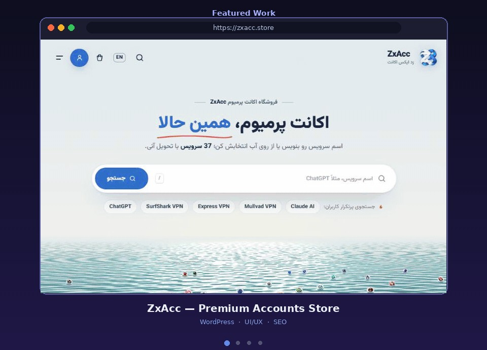

<h1 align="center">ZxAcc — Premium Accounts Store</h1>

<b>زد ایکس اکانت</b> · <a href="https://zxacc.store">zxacc.store</a>

  

  
  
  
  

---

### 📌 About the Project

An online store for premium digital accounts and subscriptions (AI tools, VPNs and more) with instant delivery.

### ✨ Features

- Smart search with popular-service shortcuts
- Interactive animated hero section
- Bilingual interface (FA / EN)
- Product catalog of 30+ digital services
- Online support widget
- Fully responsive, mobile-first layout

### 🛠 My Role

- UI/UX design and layout
- WordPress & WooCommerce development
- Performance and SEO optimization

### 🔗 Live Website

👉 **[zxacc.store](https://zxacc.store)**

---

> 🔒 This is a **showcase** repository. The source code is private for client confidentiality.
> Interested in a similar project? Contact me on Telegram: **[@fesqhli](https://t.me/fesqhli)**

Made by <a href="https://github.com/zeroux-dev">ZERO (zeroux-dev)</a>

